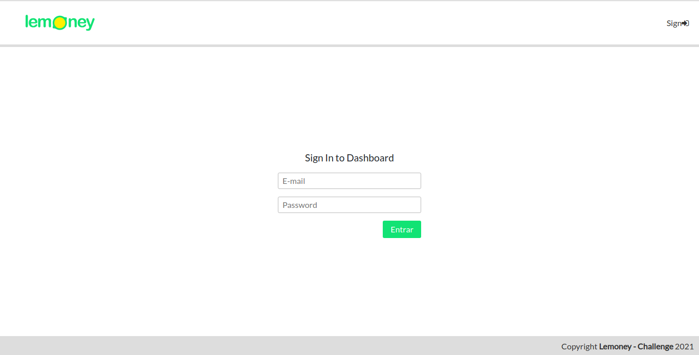
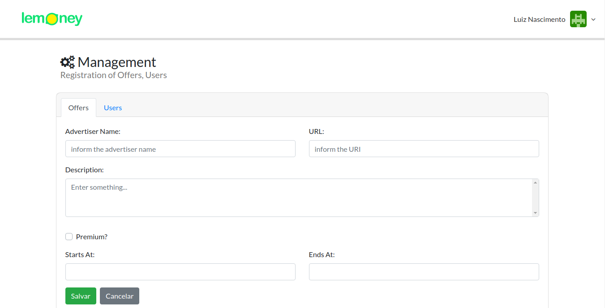
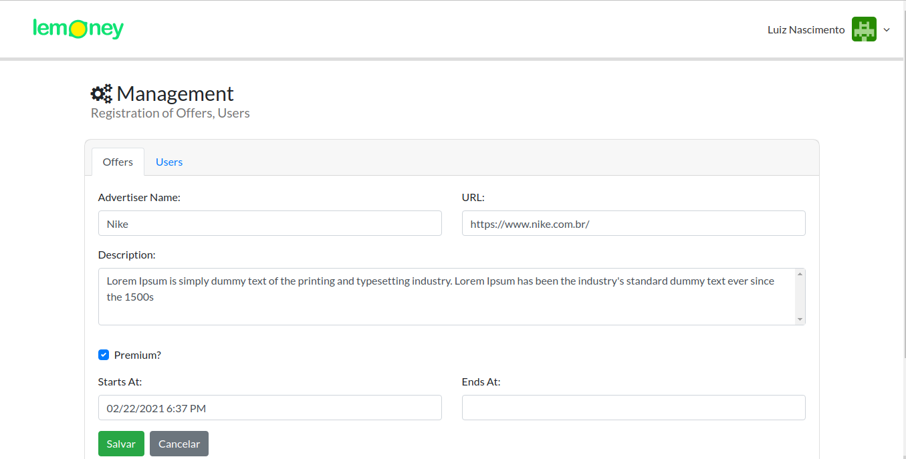

<h1 align="center">Lemoney Challenge Frontend</h1>

  

    <a href="#about-information_source">About</a>&nbsp;&nbsp;&nbsp;|&nbsp;&nbsp;&nbsp;
    <a href="#technology-computer">Technology</a>&nbsp;&nbsp;&nbsp;|&nbsp;&nbsp;&nbsp;
    <a href="#getting-started-rocket">Getting Started</a>&nbsp;&nbsp;&nbsp;|&nbsp;&nbsp;&nbsp;
  

## About :information_source:

This is the front that connects with the [API](https://github.com/nascimentolh/lemoney) that performs the registration of Offers

The app was deployed on the [Umbler](https://www.umbler.com/) and can be accessed without a link [FRONT_LEMONEY](http://lemoneyfront-com.umbler.net/)

## Technology :computer:

- **VueJS** - Vue.js is a framework for building user interfaces and "Single Page" applications
- **Axios** - JavaScript library used to make and control HTTP requests.
- **ESLint, Prettier** - Libraries used for code linting and standardization.

## Getting Started :rocket:

### Run the test

1. Run `npm install` to install the project's dependencies.
2. Run `npm run test` to run all tests implemented.

**Obs:** Tests have not yet been implemented :confused:

### Run the application

### Running locally:
NOTE: It will be necessary to have installed [NodeJS](https://nodejs.org/en/)

1. Run `npm install` to install the project dependencies.
2. Run `npm run serve` to start the application (Development).
3. The project will be executed at the link [http://localhost:8080](http://localhost:8080).

> To perform the registration of users and offers you must be authenticated. User: test@test.com || Password: test@123

> Login : [http://lemoneyfront-com.umbler.net/auth](http://lemoneyfront-com.umbler.net/auth)

### Screenshots:

